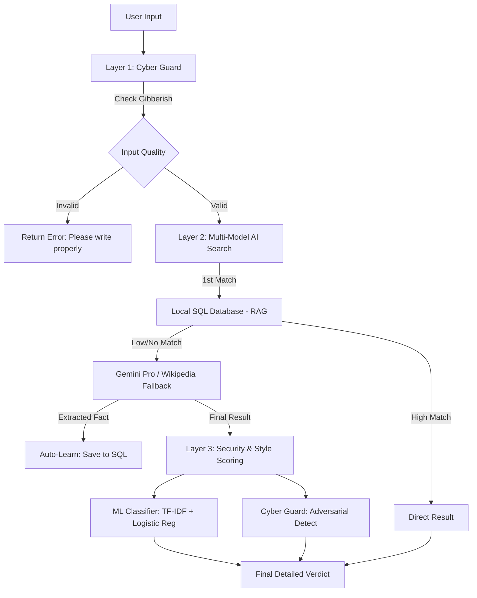

# Hybrid Fake News Detection System (Cyber Security + ML)
**Advanced Digital Forensic & Misinformation Mitigation Platform**

## 1. Project Overview
This project is a multi-layered system designed to detect and mitigate the spread of fake news using a combination of **Machine Learning (ML)** for linguistic pattern recognition and **Cyber Security** protocols for source credibility and threat mitigation. It transitions from a simple database lookup to a proactive "Defense-in-Depth" architecture.

---

## 2. System Architecture (Hybrid Logic)
The system operates on a **Three-Layer Verification Pipeline**:

---

## 3. Cyber Security Implementation
To qualify as a security project, the system implements the following "Guardrail" modules:

### 3.1 Source Credibility Scoring
- **Whitelisting**: Trusted domains (NASA, BBC, WHO) provide a negative risk score (Bonus).
- **Blacklisting**: Known misinformation domains (fakenews.com, etc.) trigger immediate "CRITICAL" risk alerts.
- **SQLite Management**: Trust scores are managed dynamically in the `claims.db`.

### 3.2 Adversarial Text Detection
The system detects "Adversarial Attacks" which aim to spread misinformation through linguistic manipulation:
- **Sensationalism (Clickbait)**: Pattern matching for words like "SHOCKING", "BANNED", "SECRET CURE".
- **Visual Attack (CapsLock/Shouting)**: Heuristics to detect excessive capitalization common in propaganda.
- **Spam Patterns**: Excessive punctuation (!!!, ???) used to create false urgency.

### 3.3 Security Guard (Gibberish & DoS)
- **Gibberish Filter**: Prevents system resource exhaustion by random character sequences.
- **Rate Limiting**: IP-based sliding window limiter stops automated bots/scripted attacks.

---

## 4. Machine Learning Implementation
### 4.1 Linguistic Classifier
- **Model**: Logistic Regression with TF-IDF Vectorization.
- **Goal**: Detect the *style* of fake news (unreliable writing) even if the *fact* is unknown.
- **Dataset**: Trained on a hybrid dataset of objective vs. sensational journalism.

### 4.2 Semantic RAG (Retrieval Augmented Generation)
- **Core**: Sentence-BERT (`all-MiniLM-L6-v2`).
- **Mechanism**: Converts text to 384-dimensional embeddings for local vector search.

---

## 5. Threat Model (Documentation Requirement)
### T1: Fake News Dissemination
*   **Asset**: Public knowledge & platform integrity.
*   **Attack**: Injection of false narratives into social threads.
*   **Mitigation**: Multi-layer verification (Local DB + Gemini).

### T2: Adversarial Character Manipulation
*   **Attack**: Using "Shouting" (CAPSLOCK) and symbols to bypass keyword filters.
*   **Mitigation**: Heuristic density analysis in `cyber_guard.py`.

### T3: System Denial (DoS)
*   **Attack**: flooding the API with 10,000 requests per minute to crash the verifier.
*   **Mitigation**: SQL-backed Rate Limiter blocking IPs after 10 requests/min.

---

## 6. How to Run
1. **Backend**: 
   - Ensure `.env` has `GOOGLE_API_KEY`.
   - Run `pip install -r requirements.txt`.
   - Run `python train_ml.py` (Trains the brain).
   - Run `run_backend.bat`.
2. **Frontend**: Open `index.html`.

---

## 7. Technical Evaluation / Viva Q&A
- **Q: Why is this better than just using ChatGPT?**
  - *Answer*: This is a hybrid local-first system. It respects privacy, implements local security guardrails, and "learns" from the internet, making it faster and more resilient over time.
- **Q: How do you handle new terminology?**
  - *Answer*: Through the "Wikipedia/Gemini Auto-Learning" fallback which updates the local SQL database for future users.
- **Q: What is the Cyber Security component?**
  - *Answer*: Our system implements Adversarial Detection, Rate Limiting, and Source Reputation Scoring (Blacklisting/Whitelisting).
